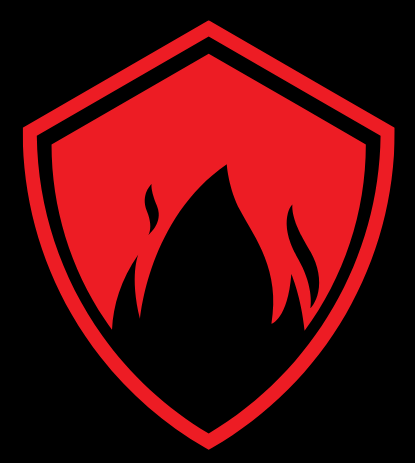
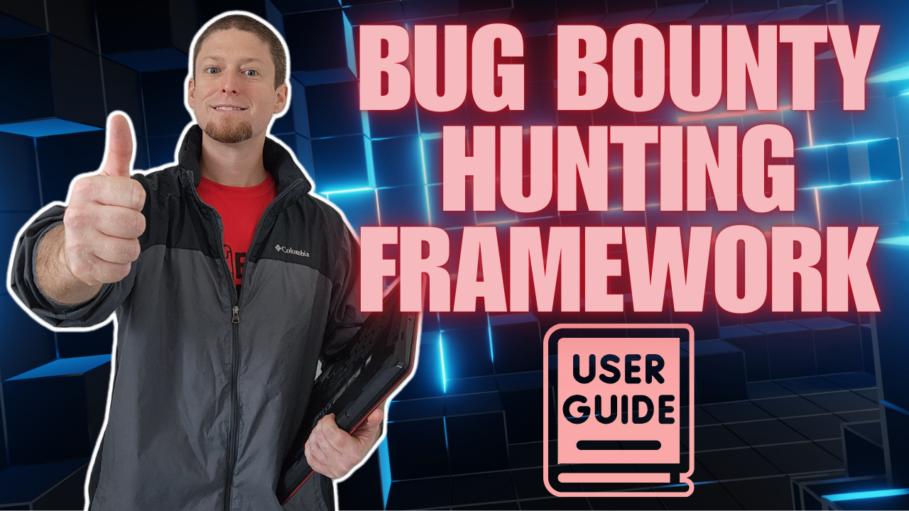

<h1 align="center">
  <a href="https://www.linkedin.com/in/%E2%84%8C%F0%9D%94%9E%F0%9D%94%AF%F0%9D%94%AF%F0%9D%94%A6%F0%9D%94%B0%F0%9D%94%AC%F0%9D%94%AB-%E2%84%9C%F0%9D%94%A6%F0%9D%94%A0%F0%9D%94%A5%F0%9D%94%9E%F0%9D%94%AF%F0%9D%94%A1%F0%9D%94%B0%F0%9D%94%AC%F0%9D%94%AB-%F0%9D%96%A2%F0%9D%96%A8%F0%9D%96%B2%F0%9D%96%B2%F0%9D%96%AF-%F0%9D%96%AE%F0%9D%96%B2%F0%9D%96%B6%F0%9D%96%A4-%F0%9D%96%AC%F0%9D%96%B2%F0%9D%96%BC-7a55bb158/"></a>
  <br>
  The Ars0n Framework
  <br>
</h1>

<h3 align="center"><em>THIS PROJECT HAS BEEN PUT ON HOLD AND IS NO LONGER BEING ACTIVELY SUPPORTED AT THIS TIME.  UPDATES WILL BE PROVIDED IN THE DISCORD SERVER WHEN AVAILABLE.</em></h3>

<h4 align="center"><strong>Designed to Help Aspiring Researchers Start Their Bug Bounty Journey and "Earn While You Learn"</strong> -- <em>by rs0n</em></h4>


<p align="center">
  <a href="#about">About</a> •
  <a href="#install">Install</a> •
  <a href="#core-modules">Modules</a> •
  <a href="#troubleshooting">Troubleshooting</a> •
  <a href="#frequently-asked-questions">FAQs</a> •
  <a href="https://ars0nsecurity.com" target=”_blank”>Ars0n Security</a> •
  <a href="https://www.youtube.com/@rs0n_live" target=”_blank”>YouTube</a> •
  <a href="https://www.twitch.tv/rs0n_live" target=”_blank”>Twitch</a> •
  <a href="https://discord.gg/yeZ8d5xbvc" target=”_blank”>Discord</a>
</p>

<div align="center">
  <a href="https://www.youtube.com/watch?v=G89LTJRQC0M"></a>
</div>

## About

Howdy!  My name is Harrison Richardson, or `rs0n` (arson) when I want to feel cooler than I really am.  The code in this repository started as a small collection of scripts to help automate many of the common Bug Bounty hunting processes I found myself repeating.  Over time, I built a simple web application with a MongoDB connection to manage my findings and identify valuable data points.  After 5 years of Bug Bounty hunting, both part-time and full-time, I'm finally ready to package this collection of tools into a proper framework.

**The Ars0n Framework** is designed to provide aspiring Application Security Engineers with all the tools they need to leverage Bug Bounty hunting as a means to learn valuable, real-world AppSec concepts and make 💰 doing it!  My goal is to lower the barrier of entry for Bug Bounty hunting by providing easy-to-use automation tools in combination with educational content and how-to guides for a wide range of Web-based and Cloud-based vulnerabilities.  In combination with my YouTube content, this framework will help aspiring Application Security Engineers to quickly and easily understand real-world security concepts that directly translate to a high paying career in Cyber Security.  

In addition to using this tool for Bug Bounty Hunting, aspiring engineers can also use this Github Repository as a canvas to practice collaborating with other developers!  This tool was inspired by Metasploit and designed to be modular in a similar way.  Each Script (Ex: `wildfire.py` or `slowburn.py`) is basically an algorithm that runs the Modules (Ex: `fire-starter.py` or `fire-scanner.py`) in a specific patter for a desired result.  Because of this design, the community is free to build new Scripts to solve a specific use-case or Modules to expand the results of these Scripts.  By learning the code in this framework and using Github to contribute your own code, aspiring engineers will continue to learn real-world skills that can be applied on the first day of a Security Engineer I position.

My hope is that this modular framework will act as a canvas to help share what I've learned over my career to the next generation of Security Engineers!  Trust me, we need all the help we can get!!

<h4 align="center">
🤠 Did you know that over 95% of scientists believe there is a direct correlation between the amount of coffee I drink and how quickly I can build new features?  Crazy, right?!  Well, now you can test their hypothesis and Buy Me a Coffee through this fancy button!!  🤯
<br>
<br>
<a href="https://www.buymeacoffee.com/rs0n.evolv3" target="_blank"></a>
</h4>

## Quick Start

Paste this code block into a clean installation of [Kali Linux 2023.4](https://old.kali.org/kali-images/kali-2023.3/kali-linux-2023.3-installer-amd64.iso) to download, install, and run the latest stable Alpha version of the framework:
```
sudo apt update && sudo apt-get update
sudo apt -y upgrade && sudo apt-get -y upgrade
wget https://github.com/R-s0n/ars0n-framework/releases/download/v0.0.2-alpha/ars0n-framework-v0.0.2-alpha.tar.gz
tar -xzvf ars0n-framework-v0.0.2-alpha.tar.gz
rm ars0n-framework-v0.0.2-alpha.tar.gz
cd ars0n-framework
./install.sh
```

## Download Latest Stable ALPHA Version

```
wget https://github.com/R-s0n/ars0n-framework/releases/download/v0.0.2-alpha/ars0n-framework-v0.0.2-alpha.tar.gz
tar -xzvf ars0n-framework-v0.0.2-alpha.tar.gz
rm ars0n-framework-v0.0.2-alpha.tar.gz
```

## Install

The Ars0n Framework includes a script that installs all the necessary tools, packages, etc. that are needed to run the framework on a clean installation of [Kali Linux 2023.4](https://www.kali.org/get-kali/#kali-installer-images).

***Please note that the only supported installation of this framework is on a clean installation of Kali Linux 2023.3.  If you choose to try and run the framework outside of a clean Kali install, I will not be able to help troubleshoot if you have any issues.***

```
./install.sh
```

This [video](https://www.youtube.com/watch?v=cF4xtVS7Rnc) shows exactly what to expect from a successful installation.

**If you are using an ARM Processor, you will need to add the --arm flag to all Install/Run scripts**

```
./install.sh --arm
```

You will be prompted to enter various API keys and tokens when the installation begins.  **Entering these is not required to run the core functionality of the framework.  If you do not enter these API keys and tokens at the time of installation, simply hit enter at each of the prompts.  The keys can be added later to the `~/.keys` directory.  More information about how to add these keys manually can be found in the [Frequently Asked Questions](#faq) section of this README.** 

## Run the Web Application (Client and Server)

Once the installation is complete, you will be given the option to run the application by entering `Y`.  If you choose not the run the application immediately, or if you need to run the application after a reboot, simply navigate to the root directly and run the `run.sh` bash script.

```
./run.sh
```

**If you are using an ARM Processor, you will need to add the --arm flag to all Install/Run scripts**

```
./run.sh --arm
```

## Core Modules

The Ars0n Framework's Core Modules are used to determine the basic scanning logic.  Each script is designed to support a specific recon methodology based on what the user is trying to accomplish.  

### Wildfire

At this time, the Wildfire script is the most widely used Core Module in the Ars0n Framework.  The purpose of this module is to allow the user to scan multiple targets that allow for testing on any subdomain discovered by the researcher.

How it works:

1. The user adds root domains through the Graphical User Interface (GUI) that they wish to scan for hidden subdomains
2. Wildfire sorts each of these domains based on the last time they were scanned to ensure the domain with the oldest data is scanned first
3. Wildfire scans each of the domains using the Sub-Modules based on the flags provided by the user.  

***Most Wildfire scans take between 8 and 48 hours to complete against a single domain if all Sub-Modules are being run.  Variations in this timing can be caused by a number of factors, including the target application and the machine running the framework.***  

***Also, please note that most data will not show in the GUI until the scan has completed.  It's best to try and run the scan overnight or over a weekend, depending on the number of domains being scanned, and return once the scan has complete to move from Recon to Enumeration.***

Running Wildfire:

#### Graphical User Interface (GUI)

Wildfire can be run from the GUI using the Wildfire button on the dashboard. Once clicked, the front-end will use the checkboxes on the screen to determine what flags should be passed to the scanner.

*Please note that running scans from the GUI still has a few bugs and edge cases that haven't been sorted out.  If you have any issues, you can simply run the scan form the CLI.*

#### Command Line Interface (CLI)

All Core Modules for The Ars0n Framework are stored in the `/toolkit` directory.  Simply navigate to the directory and run `wildfire.py` with the necessary flags.  At least one Sub-Module flag must be provided.

```
python3 wildfire.py --start --cloud --scan
```

#### Slowburn

Unlike the Wildfire module, which requires the user to identify target domains to scan, the Slowburn module does that work for you.  By communicating with APIs for various bug bounty hunting platforms, this script will identify all domains that allow for testing on any discovered subdomain.  Once the data has been populated, Slowburn will randomly choose one domain at a time to scan in the same way Wildfire does.  

***Please note that the Slowburn module is still in development and is not considered part of the stable alpha release.  There will likely be bugs and edge cases encountered by the user.***

In order for Slowburn to identify targets to scan, it must first be initialized.  This initialization step collects the necessary data from various API's and deposits them into a JSON file stored locally.  Once this initialization step is complete, Slowburn will automatically begin selecting and scanning one target at a time.

To initalize Slowburn, simply run the following command:

```
python3 slowburn.py --initialize
```

Once the data has been collected, it is up to the user whether they want to re-initialize the tool upon the next scan.  

***Remember that the scope and targets on public bug bounty programs can change frequently.  If you choose to run Slowburn without initializing the data, you may be scanning domains that are no longer in scope for the program.  It is strongly recommended that Slowburn be re-initialized each time before running.***

If you choose not to re-initialize the target data, you can run Slowburn using the previously collected data with the following command:

```
python3 slowburn.py
```

## Sub-Modules

The Ars0n Framework's Sub-Modules are designed to be leveraged by the Core Modules to divide the Recon & Enumeration phases into specific tasks.  The data collected in each Sub-Module is used by the others to expand your picture of the target's attack surface.  

### Fire-Starter

Fire-Starter is the first step to performing recon against a target domain.  The goal of this script is to collect a wealth of information about the attack surface of your target.  Once collected, this data will be used by all other Sub-Modules to help the user identify a specific URL that is potentially vulnerable.

Fire-Starter works by running a series of open-source tools to enumerate hidden subdomains, DNS records, and the ASN's to identify where those external entries are hosted.  Currently, Fire-Starter works by chaining together the following widely used open-source tools:

- Amass
- Sublist3r
- Assetfinder
- Get All URL's (GAU)
- Certificate Transparency Logs (CRT)
- Subfinder
- ShuffleDNS
- GoSpider
- Subdomainizer

These tools cover a wide range of techniques to identify hidden subdomains, including web scraping, brute force, and crawling to identify links and JavaScript URLs.

***Once the scan is complete, the Dashboard will be updated and available to the user.***

**Most Sub-Modules in The Ars0n Framework requre the data collected from the Fire-Starter module to work.  With this in mind, Fire-Starter must be included in the first scan against a target for any usable data to be collected.**

### Fire-Cloud

Coming soon...

### Fire-Scanner

Fire-Scanner uses the results of Fire-Starter and Fire-Cloud to perform [Wide-Band Scanning](https://www.linkedin.com/feed/update/urn:li:activity:6849314055283466240/) against all subdomains and cloud services that have been discovered from previous scans.

At this stage of development, this script leverages [Nuclei](https://github.com/projectdiscovery/nuclei) almost exclusively for all scanning.  Instead of simply running the tool, Fire-Scanner breaks the scan down into specific collections of [Nuclei Templates](https://github.com/projectdiscovery/nuclei-templates) and scans them one by one.  This strategy helps ensure the scans are stable and produce consistent results, removes any unnecessary or unsafe scan checks, and produces actionable results.

## Troubleshooting

The **vast majority** of issues installing and/or running the Ars0n Framework are caused by not installing the tool on a clean installation of Kali Linux.  

***It is important to remember that, at its core, the Ars0n Framework is a collection of automation scripts designed to run existing open-source tools.  Each of these tools have their own ways of operating and can experience unexpected behavior if conflicts emerge with any existing service/tool running on the user's system.  This complexity is the reason why running The Ars0n Framework should only be run on a clean installation of Kali Linux.***

Another very common issue users experience is caused by MongoDB not successfully installing and/or running on their machine.  *The most common manifestation of this issue is the user is unable to add an initial FQDN and simply sees a broken GUI.*  If this occurs, please ensure that your machine has the necessary system requirements to run MongoDB.  Unfortunately, there is no current solution if you run into this issue.

## Frequently Asked Questions

Coming soon...
